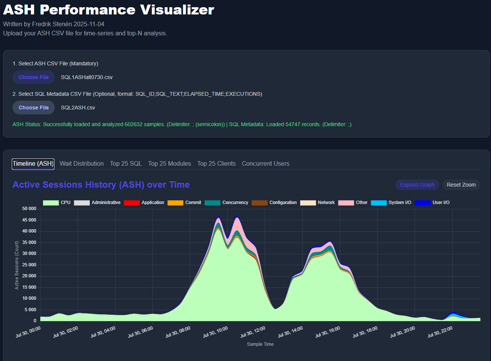

# ASH Visualizer Tool User Manual

---

## 1. Overview
The **ASH Visualizer Tool** is designed to help you analyze Oracle Active Session History (ASH) data visually. It allows you to load, visualize, and explore session activity, wait classes, SQL operations, and more.


---

## 2. Prerequisites
- Access to an Oracle database with `V$ACTIVE_SESSION_HISTORY` and `DBA_HIST_ACTIVE_SESS_HISTORY` views.
- A web browser to open the `ashoffline.html` file.

---

## 3. Generating ASH Data
To generate the ASH data required for visualization, run the following SQL scripts in your Oracle database:

### Script 1: Generate ASH Data (Recent Activity)
```sql
-- Generate ASH data
SELECT
    to_char(sample_time,'YYYYMMDDHH24MISS') as SAMPLE_TIME2,
    SQL_ID,
    SESSION_STATE,
    WAIT_CLASS,
    WAIT_TIME,
    SQL_PLAN_OPERATION,
    SQL_PLAN_OPTIONS,
    MODULE,
    ACTION,
    CLIENT_ID,
    MACHINE,
    PROGRAM,
    EVENT
FROM
    V\$Active_Session_History
```

### Script 2: Generate ASH Data (Historical Activity)
```sql
-- Generate ASH data (alternative version for longer history)
SELECT
    to_char(sample_time,'YYYYMMDDHH24MISS') as SAMPLE_TIME2,
    SQL_ID,
    SESSION_STATE,
    WAIT_CLASS,
    WAIT_TIME,
    SQL_PLAN_OPERATION,
    SQL_PLAN_OPTIONS,
    MODULE,
    ACTION,
    CLIENT_ID,
    MACHINE,
    PROGRAM,
    EVENT
FROM
    DBA_HIST_ACTIVE_SESS_HISTORY
WHERE
    sample_time BETWEEN TO_TIMESTAMP('2025-10-27 00:00:00', 'YYYY-MM-DD HH24\:MI\:SS') AND TO_TIMESTAMP('2025-10-31 23:59:00', 'YYYY-MM-DD HH24\:MI\:SS');
```

### Script 3: Generate SQL Data (Optional but Recommended)
```sql
-- Generate SQL data
SELECT DISTINCT
    s.sql_id,
    REPLACE(
        REPLACE(
            REPLACE(
                REPLACE(s.sql_text, CHR(10), ' '), -- Remove newlines
                CHR(13), ' '),                     -- Remove carriage returns
            ';', ''),                              -- Remove semicolons
        '"', '""') AS sql_text,                    -- Escape double quotes
    s.elapsed_time,
    s.executions
FROM
    v\$sql s
WHERE
    s.sql_id IN (SELECT DISTINCT ash.sql_id FROM v\$active_session_history ash);
```
**Note:** Save the output of this script as `sql_data.csv` for additional details in the tool.

---

## 4. Using the ASH Visualizer Tool

### Step 1: Prepare Your Data
- Run the SQL scripts above and export the results as CSV files (`ash_data.csv` and optionally `sql_data.csv`).

### Step 2: Open the Visualizer
- Open the `ashoffline.html` file in a web browser.

### Step 3: Load Your Data
- Use the file upload feature in the tool to load your `ash_data.csv` file (and optionally `sql_data.csv`).

### Step 4: Explore the Visualizations
- The tool provides interactive charts and tables to explore:
  - Session states
  - Wait classes
  - SQL operations
  - Event timelines

### Step 5: Customize Your View
- Use the tabs and filters to focus on specific time ranges, SQL IDs, or wait classes.

---

## 5. Features
- **Interactive Charts:** Visualize session activity and wait times.
- **Dark Mode:** Optimized for low-light environments.
- **Responsive Design:** Works on both desktop and mobile devices.

---

## 6. Troubleshooting
- If data fails to load, ensure your CSV files are formatted correctly.
- For performance issues, limit the date range in your SQL queries.
